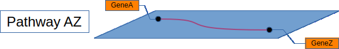
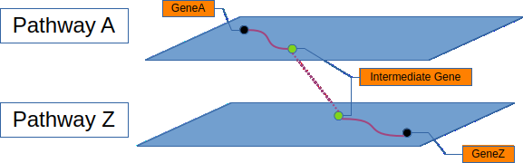
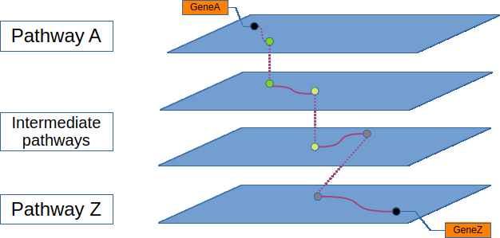

# Path-Tailor

## The vision
Path Tailor is a computational biology tool that looks for gene interactions between 
GeneA and GeneZ across known pathways of KEGG databases. The tool returns a set of pathways 
that share common nodes (genes or metabolites) and link GeneA to GeneZ across this set. Additionally,
it visualises these interactions in the network graph **[to be developed]**. The tool is planned to have user-friendly app interface
of Streamlit. **[to be developed]**

## Overview of data gathering and processing
### Data gathering 
Path Tailor uses KEGG pathway databases as a source data for pathways, genes and graph elements of KEGG pathways.
For data extraction and processing it uses libraries of `bioservices`, `Bio` that provides an interface to access 
KEGG through its API.

### Data processing
The tool looks for the pathways containing GeneA (PathwaysA) or GeneZ(PathwaysZ). 
The result leads to one of the three scenarios:
- Tool detects pathways that hold both geneA and geneZ (pathwaysAZ)



- If there are no pathways with genes A and Z, then it looks for other common nodes (gene products or metabolites) 
that would link each pair of pathways (Sew them like Sheets over the genes and for the [Seams](https://www.merriam-webster.com/dictionary/seam) - hence the names of Classes within the code)



- If pathwaysA and pathwaysZ have no common nodes, the algorythm looks for intermediate pathways that 
share other genes with pathwaysA or pathwaysZ **[to be developed]**.
  - (Alternatively, it should be possible to introduce additional genes from omics experiments. However, 
  this idea is yet to be explored. **[to be developed]** (See   **Further Visions**)
  
  


### Data visualisation **[to be developed]**
For data visualisation it will use combination of `networkx`, `pyviz` to create interactive network graphs with 
kegg pathway graph aesthetics. All the preference options, inputs, and graphs will be wrapped into a 
quick app framework `streamlit`.

### Outputs
So far, outputs are stored into `pickle` files for development reasons. 
Intermediate and final outputs will be stored into csv, txt and other formats that are 
comprehensive for non-coding researchers. The application will also provide option to
download a pdf/html report. 

## Further visions

The current code detects the sets of pathways linking two genes.
With additional script, it should be possible to iterate through multiple pairs of genes from omics exeperiments 
and create a meta-network of related pathways. Such analysis should reveal a set of pathways
that include all genes with impaired expression and show how those pathways 
interact with each other. 

Visually speaking, it would show if sub network 
of PathwayA - intermediate pathways - PathwayZ have any interactions with PathwayB-PathwayX. 
For example:

```
PathwayA - intermediate pathways - PathwayZ
                    | 
                PathwayB - PathwayX - PathwayI
                    |
    PathwayC - PathwayD
```


